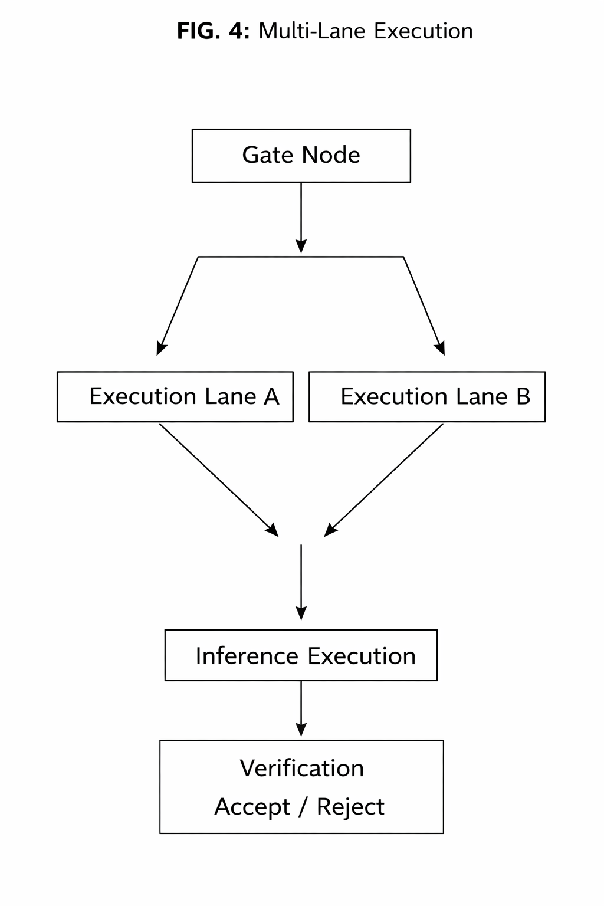
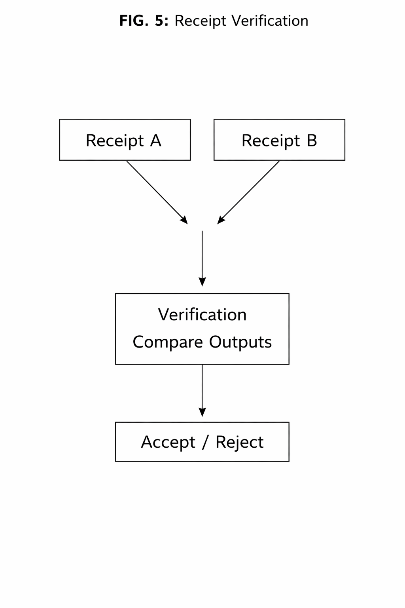

# TriTrap Architecture Overview

TriTrap is an experimental architecture for deterministic execution of artificial intelligence inference workloads.
This document describes the invention/protocol architecture layer.
It does not, by itself, prove the current canonical live runtime state.

The design explores mechanisms for controlled execution environments, multi-path execution validation, and verifiable computation outcomes.

The goal of the architecture is to improve reliability, governance, and reproducibility of AI inference processes.

---

## Public Runtime Maturity

TriTrap separates public architecture documentation from private operational evidence.

The public repository describes protocol concepts, runtime posture, evidence handling, and disclosure boundaries. Private deployment mechanics, proof archives, verifier internals, topology, runtime paths, keys, and operational commands remain outside this repository.

Public runtime documents:

- [Documentation Index](README.md)
- [Current Runtime Status](current_runtime_status.md)
- [Evidence Model](evidence_model.md)
- [Non-Disclosure Boundary](non_disclosure_boundary.md)
- [Runtime Maturity Matrix](runtime_maturity_matrix.md)
- [Public Audit Checklist](public_audit_checklist.md)
- [Execution Modes](execution_modes.md)
- [Proof Slice Example](proof_slice_example.md)
- [Claim Boundary](claim_boundary.md)
- [Limitations](limitations.md)
- [Threat Model](threat_model.md)
- [Technical Due Diligence](technical_due_diligence.md)
- [One Page Brief](one_page_brief.md)
- [Use Cases](use_cases.md)
- [Partner Overview](partner_overview.md)
- [Design Philosophy](design_philosophy.md)

---

## Architecture Overview

The high-level architecture of TriTrap is illustrated below.

**FIG.1 — TriTrap System Architecture**

The Gate coordinates controlled execution across separate execution lanes and routes results into a verification layer.

---

## Research Focus

• deterministic execution paths  
• governed inference environments  
• verifiable execution outcomes  
• architecture for multi-lane validation systems  

---

## Core Concepts

TriTrap explores a model where inference execution is governed by explicit authorization artifacts called **permits**.

Execution requests are validated by a **Gate node**, dispatched to separate **execution lanes**, and validated through **receipt verification**.

The architecture is designed to enable deterministic and auditable execution flows.

---

## Permit Structure

Permits represent authorization for a specific execution request.

**FIG.2 — Permit Structure**

A permit contains metadata used by the Gate to validate execution authority.

Typical fields include:

- Permit ID  
- Scope Hash  
- Time-To-Live (TTL)  
- Key Identifier  
- Integrity Code  

---

## Operational Flow

The basic operational flow of the system is shown below.

**FIG.3 — Operational Flow**

Execution proceeds through the following stages:

Request  
→ Gate validation  
→ Permit generation  
→ Lane execution  
→ Receipt creation  
→ Verification

---

## Multi-Lane Execution

TriTrap supports parallel execution across multiple separate compute lanes.

**FIG.4 — Multi-Lane Execution**

The Gate dispatches workloads to multiple execution lanes where inference tasks are performed concurrently.  
Results are returned to a verification stage for comparison.

---

## Receipt Verification

Execution outcomes are validated through receipt comparison.

**FIG.5 — Receipt Verification**

Receipts produced by multiple lanes are compared by the verification layer.

If outputs match within defined criteria the result is accepted.  
If outputs diverge the system may reject the result or trigger arbitration.

---

## Status

Invention/protocol architecture document, not a standalone live-runtime proof record.
